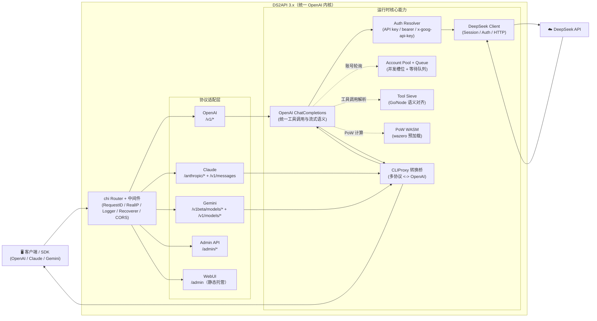

<p align="center">
  
</p>

# DS2API

[](LICENSE)


[](https://github.com/CJackHwang/ds2api/releases)
[](docs/DEPLOY.md)
[](https://zeabur.com/templates/L4CFHP)
[](https://vercel.com/new/clone?repository-url=https://github.com/CJackHwang/ds2api)

语言 / Language: [中文](README.MD) | [English](README.en.md)

将 DeepSeek Web 对话能力转换为 OpenAI、Claude 与 Gemini 兼容 API。后端为 **Go 全量实现**，前端为 React WebUI 管理台（源码在 `webui/`，部署时自动构建到 `static/admin`）。

> **重要免责声明**
>
> 本仓库仅供学习、研究、个人实验和内部验证使用，不提供任何形式的商业授权、适用性保证或结果保证。
>
> 作者及仓库维护者不对因使用、修改、分发、部署或依赖本项目而产生的任何直接或间接损失、账号封禁、数据丢失、法律风险或第三方索赔负责。
>
> 请勿将本项目用于违反服务条款、协议、法律法规或平台规则的场景。商业使用前请自行确认 `LICENSE`、相关协议以及你是否获得了作者的书面许可。

## 架构概览



- **后端**：Go（`cmd/ds2api/`、`api/`、`internal/`），不依赖 Python 运行时
- **前端**：React 管理台（`webui/`），运行时托管静态构建产物
- **部署**：本地运行、Docker、Vercel Serverless、Linux systemd

### 3.0 底层架构调整（相较旧版本）

- **统一路由内核**：所有协议入口统一汇聚到 `internal/server/router.go`，并在同一路由树中注册 OpenAI / Claude / Gemini / Admin / WebUI 路由，避免多入口行为漂移。
- **统一执行链路**：Claude / Gemini 入口先经 `internal/translatorcliproxy` 做协议转换，再进入 `openai.ChatCompletions` 统一处理工具调用与流式语义，最后再转换回原协议响应。
- **适配器分层更清晰**：`internal/adapter/{claude,gemini}` 负责入口/出口协议封装，`internal/adapter/openai` 负责核心执行，DeepSeek 侧调用只保留在 OpenAI 内核中。
- **Tool Calling 双运行时对齐**：Go 侧（`internal/util`）与 Vercel Node 侧（`internal/js/helpers/stream-tool-sieve`）保持一致的解析/防泄漏语义，覆盖 JSON / XML / invoke / text-kv 多风格输入。
- **配置与运行时设置解耦**：静态配置（`config`）与运行时策略（`settings`）通过 Admin API 分离管理，支持热更新和密码轮换失效旧 JWT。
- **流式能力升级**：`/v1/responses` 与 `/v1/chat/completions` 共享更一致的工具调用增量输出策略，降低不同 SDK 下的行为差异。
- **可观测与可运维增强**：`/healthz`、`/readyz`、`/admin/version`、`/admin/dev/captures` 形成排障闭环，便于发布后验证。

## 核心能力

| 能力 | 说明 |
| --- | --- |
| OpenAI 兼容 | `GET /v1/models`、`GET /v1/models/{id}`、`POST /v1/chat/completions`、`POST /v1/responses`、`GET /v1/responses/{response_id}`、`POST /v1/embeddings` |
| Claude 兼容 | `GET /anthropic/v1/models`、`POST /anthropic/v1/messages`、`POST /anthropic/v1/messages/count_tokens`（及快捷路径 `/v1/messages`、`/messages`） |
| Gemini 兼容 | `POST /v1beta/models/{model}:generateContent`、`POST /v1beta/models/{model}:streamGenerateContent`（及 `/v1/models/{model}:*` 路径） |
| 多账号轮询 | 自动 token 刷新、邮箱/手机号双登录方式 |
| 并发队列控制 | 每账号 in-flight 上限 + 等待队列，动态计算建议并发值 |
| DeepSeek PoW | WASM 计算（`wazero`），无需外部 Node.js 依赖 |
| Tool Calling | 防泄漏处理：非代码块高置信特征识别、`delta.tool_calls` 早发、结构化增量输出 |
| Admin API | 配置管理、运行时设置热更新、账号测试 / 批量测试、会话清理、导入导出、Vercel 同步、版本检查 |
| WebUI 管理台 | `/admin` 单页应用（中英文双语、深色模式） |
| 运维探针 | `GET /healthz`（存活）、`GET /readyz`（就绪） |

## 平台兼容矩阵

| 级别 | 平台 | 当前状态 |
| --- | --- | --- |
| P0 | Codex CLI/SDK（`wire_api=chat` / `wire_api=responses`） | ✅ |
| P0 | OpenAI SDK（JS/Python，chat + responses） | ✅ |
| P0 | Vercel AI SDK（openai-compatible） | ✅ |
| P0 | Anthropic SDK（messages） | ✅ |
| P0 | Google Gemini SDK（generateContent） | ✅ |
| P1 | LangChain / LlamaIndex / OpenWebUI（OpenAI 兼容接入） | ✅ |
| P2 | MCP 独立桥接层 | 规划中 |

## 模型支持

### OpenAI 接口

| 模型 | thinking | search |
| --- | --- | --- |
| `deepseek-chat` | ❌ | ❌ |
| `deepseek-reasoner` | ✅ | ❌ |
| `deepseek-chat-search` | ❌ | ✅ |
| `deepseek-reasoner-search` | ✅ | ✅ |

### Claude 接口

| 模型 | 默认映射 |
| --- | --- |
| `claude-sonnet-4-5` | `deepseek-chat` |
| `claude-haiku-4-5`（兼容 `claude-3-5-haiku-latest`） | `deepseek-chat` |
| `claude-opus-4-6` | `deepseek-reasoner` |

可通过配置中的 `claude_mapping` 或 `claude_model_mapping` 覆盖映射关系。
另外，`/anthropic/v1/models` 现已包含 Claude 1.x/2.x/3.x/4.x 历史模型 ID 与常见别名，便于旧客户端直接兼容。


#### Claude Code 接入避坑（实测）

- `ANTHROPIC_BASE_URL` 推荐直接指向 DS2API 根地址（例如 `http://127.0.0.1:5001`），Claude Code 会请求 `/v1/messages?beta=true`。
- `ANTHROPIC_API_KEY` 需要与 `config.json` 中 `keys` 一致；建议同时保留常规 key 与 `sk-ant-*` 形态 key，兼容不同客户端校验习惯。
- 若系统设置了代理，建议对 DS2API 地址配置 `NO_PROXY=127.0.0.1,localhost,<你的主机IP>`，避免本地回环请求被代理拦截。
- 如遇“工具调用输出成文本、未执行”问题，请升级到包含 Claude 工具调用多格式解析（JSON/XML/ANTML/invoke）的版本。

### Gemini 接口

Gemini 适配器将模型名通过 `model_aliases` 或内置规则映射到 DeepSeek 原生模型，支持 `generateContent` 和 `streamGenerateContent` 两种调用方式，并完整支持 Tool Calling（`functionDeclarations` → `functionCall` 输出）。

## 快速开始

### 通用第一步（所有部署方式）

把 `config.json` 作为唯一配置源（推荐做法）：

```bash
cp config.example.json config.json
# 编辑 config.json
```

后续部署建议：
- 本地运行：直接读取 `config.json`
- Docker / Vercel：由 `config.json` 生成 `DS2API_CONFIG_JSON`（Base64）注入环境变量
- 兼容写法：`DS2API_CONFIG_JSON` 也可以直接写原始 JSON；`CONFIG_JSON` 是旧版回退变量

### 方式一：本地运行

**前置要求**：Go 1.26+，Node.js 20+（仅在需要构建 WebUI 时）

```bash
# 1. 克隆仓库
git clone https://github.com/CJackHwang/ds2api.git
cd ds2api

# 2. 配置
cp config.example.json config.json
# 编辑 config.json，填入你的 DeepSeek 账号信息和 API key

# 3. 启动
go run ./cmd/ds2api
```

默认监听地址：`http://localhost:5001`

> **WebUI 自动构建**：本地首次启动时，若 `static/admin` 不存在，会自动尝试执行 `npm ci`（仅在缺少依赖时）和 `npm run build -- --outDir static/admin --emptyOutDir`（需要本机有 Node.js）。你也可以手动构建：`./scripts/build-webui.sh`

### 方式二：Docker 运行

```bash
# 1. 准备环境变量和配置文件
cp .env.example .env
cp config.example.json config.json

# 2. 编辑 .env（至少设置 DS2API_ADMIN_KEY）
#    DS2API_ADMIN_KEY=请替换为强密码

# 3. 启动
docker-compose up -d

# 4. 查看日志
docker-compose logs -f
```

默认 `docker-compose.yml` 会把宿主机 `6011` 映射到容器内的 `5001`。如果你希望直接对外暴露 `5001`，请调整 `ports` 配置。

更新镜像：`docker-compose up -d --build`

#### Zeabur 一键部署（Dockerfile）

1. 点击上方 “Deploy on Zeabur” 按钮，一键部署。
2. 部署完成后访问 `/admin`，使用 Zeabur 环境变量/模板指引中的 `DS2API_ADMIN_KEY` 登录。
3. 在管理台导入/编辑配置（会写入并持久化到 `/data/config.json`）。

说明：Zeabur 使用仓库内 `Dockerfile` 直接构建时，不需要额外传入 `BUILD_VERSION`；镜像会优先读取该构建参数，未提供时自动回退到仓库根目录的 `VERSION` 文件。

### 方式三：Vercel 部署

1. Fork 仓库到自己的 GitHub
2. 在 Vercel 上导入项目
3. 配置环境变量（最少设置 `DS2API_ADMIN_KEY`；推荐同时设置 `DS2API_CONFIG_JSON`）
4. 部署

建议先在仓库目录复制模板并填写：

```bash
cp config.example.json config.json
# 编辑 config.json
```

推荐：先本地把 `config.json` 转成 Base64，再粘贴到 `DS2API_CONFIG_JSON`，避免 JSON 格式错误：

```bash
base64 < config.json | tr -d '\n'
```

> **流式说明**：`/v1/chat/completions` 在 Vercel 上默认走 `api/chat-stream.js`（Node Runtime）以保证实时 SSE。鉴权、账号选择、会话/PoW 准备仍由 Go 内部 prepare 接口完成；流式响应（含 `tools`）在 Node 侧执行与 Go 对齐的输出组装与防泄漏处理。

详细部署说明请参阅 [部署指南](docs/DEPLOY.md)。

### 方式四：下载 Release 构建包

每次发布 Release 时，GitHub Actions 会自动构建多平台二进制包：

```bash
# 下载对应平台的压缩包后
tar -xzf ds2api_<tag>_linux_amd64.tar.gz
cd ds2api_<tag>_linux_amd64
cp config.example.json config.json
# 编辑 config.json
./ds2api
```

### 方式五：OpenCode CLI 接入

1. 复制示例配置：

```bash
cp opencode.json.example opencode.json
```

2. 编辑 `opencode.json`：
- 将 `baseURL` 改为你的 DS2API 地址（例如 `https://your-domain.com/v1`）
- 将 `apiKey` 改为你的 DS2API key（对应 `config.keys`）

3. 在项目目录启动 OpenCode CLI（按你的安装方式运行 `opencode`）。

> 建议优先使用 OpenAI 兼容路径（`/v1/*`），即示例里的 `@ai-sdk/openai-compatible` provider。
> 若客户端支持 `wire_api`，可分别测试 `responses` 与 `chat`，DS2API 两条链路都兼容。

## 配置说明

### `config.json` 示例

```json
{
  "keys": ["your-api-key-1", "your-api-key-2"],
  "accounts": [
    {
      "email": "user@example.com",
      "password": "your-password"
    },
    {
      "mobile": "12345678901",
      "password": "your-password"
    }
  ],
  "model_aliases": {
    "gpt-4o": "deepseek-chat",
    "gpt-5-codex": "deepseek-reasoner",
    "o3": "deepseek-reasoner"
  },
  "compat": {
    "wide_input_strict_output": true
  },
  "responses": {
    "store_ttl_seconds": 900
  },
  "embeddings": {
    "provider": "deterministic"
  },
  "claude_mapping": {
    "fast": "deepseek-chat",
    "slow": "deepseek-reasoner"
  },
  "admin": {
    "jwt_expire_hours": 24
  },
  "runtime": {
    "account_max_inflight": 2,
    "account_max_queue": 0,
    "global_max_inflight": 0,
    "token_refresh_interval_hours": 6
  },
  "auto_delete": {
    "sessions": false
  }
}
```

- `keys`：API 访问密钥列表，客户端通过 `Authorization: Bearer <key>` 鉴权
- `accounts`：DeepSeek 账号列表，支持 `email` 或 `mobile` 登录
- `token`：配置文件中即使填写也会在加载时被清空（不会从 `config.json` 读取 token）；实际 token 仅在运行时内存中维护并自动刷新
- `model_aliases`：常见模型名（如 GPT/Codex/Claude）到 DeepSeek 模型的映射
- `compat.wide_input_strict_output`：建议保持 `true`（当前实现默认宽进严出）
- `toolcall`：策略已固定为特征匹配 + 高置信早发，不再作为可配置项
- `responses.store_ttl_seconds`：`/v1/responses/{id}` 的内存缓存 TTL
- `embeddings.provider`：embedding 提供方（当前内置 `deterministic/mock/builtin`）
- `claude_mapping`：字典中 `fast`/`slow` 后缀映射到对应 DeepSeek 模型（兼容读取 `claude_model_mapping`）
- `admin`：管理后台设置（JWT 过期时间、密码哈希等），可通过 Admin Settings API 热更新
- `runtime`：运行时参数（并发限制、队列大小、托管账号 token 刷新间隔），可通过 Admin Settings API 热更新；`account_max_queue=0`/`global_max_inflight=0` 表示按推荐值自动计算，`token_refresh_interval_hours=6` 为默认强制重登间隔
- `auto_delete.sessions`：是否在请求结束后自动清理 DeepSeek 会话（默认 `false`，可在 Settings 热更新）

### 环境变量

| 变量 | 用途 | 默认值 |
| --- | --- | --- |
| `PORT` | 服务端口 | `5001` |
| `LOG_LEVEL` | 日志级别 | `INFO`（可选：`DEBUG`/`WARN`/`ERROR`） |
| `DS2API_ADMIN_KEY` | Admin 登录密钥 | `admin` |
| `DS2API_JWT_SECRET` | Admin JWT 签名密钥 | 等同 `DS2API_ADMIN_KEY` |
| `DS2API_JWT_EXPIRE_HOURS` | Admin JWT 过期小时数 | `24` |
| `DS2API_CONFIG_PATH` | 配置文件路径 | `config.json` |
| `DS2API_CONFIG_JSON` | 直接注入配置（JSON 或 Base64） | — |
| `CONFIG_JSON` | 旧版兼容配置注入 | — |
| `DS2API_ENV_WRITEBACK` | 环境变量模式下自动写回配置文件并切换文件模式（`1/true/yes/on`） | 关闭 |
| `DS2API_WASM_PATH` | PoW WASM 文件路径 | 自动查找 |
| `DS2API_STATIC_ADMIN_DIR` | 管理台静态文件目录 | `static/admin` |
| `DS2API_AUTO_BUILD_WEBUI` | 启动时自动构建 WebUI | 本地开启，Vercel 关闭 |
| `DS2API_DEV_PACKET_CAPTURE` | 本地开发抓包开关（记录最近会话请求/响应体） | 本地非 Vercel 默认开启 |
| `DS2API_DEV_PACKET_CAPTURE_LIMIT` | 本地抓包保留条数（超出自动淘汰） | `5` |
| `DS2API_DEV_PACKET_CAPTURE_MAX_BODY_BYTES` | 单条响应体最大记录字节数 | `2097152` |
| `DS2API_ACCOUNT_MAX_INFLIGHT` | 每账号最大并发 in-flight 请求数 | `2` |
| `DS2API_ACCOUNT_CONCURRENCY` | 同上（兼容旧名） | — |
| `DS2API_ACCOUNT_MAX_QUEUE` | 等待队列上限 | `recommended_concurrency` |
| `DS2API_ACCOUNT_QUEUE_SIZE` | 同上（兼容旧名） | — |
| `DS2API_GLOBAL_MAX_INFLIGHT` | 全局最大 in-flight 请求数 | `recommended_concurrency` |
| `DS2API_MAX_INFLIGHT` | 同上（兼容旧名） | — |
| `DS2API_VERCEL_INTERNAL_SECRET` | Vercel 混合流式内部鉴权密钥 | 回退用 `DS2API_ADMIN_KEY` |
| `DS2API_VERCEL_STREAM_LEASE_TTL_SECONDS` | 流式 lease 过期秒数 | `900` |
| `DS2API_DEV_PACKET_CAPTURE` | 本地开发抓包开关（记录最近会话请求/响应体） | 本地非 Vercel 默认开启 |
| `DS2API_DEV_PACKET_CAPTURE_LIMIT` | 本地抓包保留条数（超出自动淘汰） | `5` |
| `DS2API_DEV_PACKET_CAPTURE_MAX_BODY_BYTES` | 单条响应体最大记录字节数 | `2097152` |
| `VERCEL_TOKEN` | Vercel 同步 token | — |
| `VERCEL_PROJECT_ID` | Vercel 项目 ID | — |
| `VERCEL_TEAM_ID` | Vercel 团队 ID | — |
| `DS2API_VERCEL_PROTECTION_BYPASS` | Vercel 部署保护绕过密钥（内部 Node→Go 调用） | — |

> 提示：当检测到 `DS2API_CONFIG_JSON/CONFIG_JSON` 时，管理台会显示当前模式风险与自动持久化状态（含 `DS2API_CONFIG_PATH` 路径与模式切换说明）。

## 鉴权模式

调用业务接口（`/v1/*`、`/anthropic/*`、Gemini 路由）时支持两种模式：

| 模式 | 说明 |
| --- | --- |
| **托管账号模式** | `Bearer` 或 `x-api-key` 传入 `config.keys` 中的 key，由服务自动轮询选择账号 |
| **直通 token 模式** | 传入 token 不在 `config.keys` 中时，直接作为 DeepSeek token 使用 |

可选请求头 `X-Ds2-Target-Account`：指定使用某个托管账号（值为 email 或 mobile）。
Gemini 路由还可以使用 `x-goog-api-key`，或在没有认证头时使用 `?key=` / `?api_key=` 作为调用方凭据。

## 并发模型

```
每账号可用并发 = DS2API_ACCOUNT_MAX_INFLIGHT（默认 2）
建议并发值 = 账号数量 × 每账号并发上限
等待队列上限 = DS2API_ACCOUNT_MAX_QUEUE（默认 = 建议并发值）
429 阈值 = in-flight + 等待队列 ≈ 账号数量 × 4
```

- 当 in-flight 槽位满时，请求进入等待队列，**不会立即 429**
- 超出总承载上限后才返回 `429 Too Many Requests`
- `GET /admin/queue/status` 返回实时并发状态

## Tool Call 适配

当请求中带 `tools` 时，DS2API 会做防泄漏处理与结构化转译：

1. 只在**非代码块上下文**启用执行型 toolcall 识别（代码块示例默认不触发）
2. 解析层以 XML/Markup 为最高优先级，同时兼容 JSON / ANTML / invoke / text-kv，并统一归一到内部工具调用结构
3. `responses` 流式严格使用官方 item 生命周期事件（`response.output_item.*`、`response.content_part.*`、`response.function_call_arguments.*`）
4. `responses` 支持并执行 `tool_choice`（`auto`/`none`/`required`/强制函数）；`required` 违规时非流式返回 `422`，流式返回 `response.failed`
5. 客户端请求哪种协议，就按该协议返回工具调用（OpenAI/Claude/Gemini 各自原生结构）；模型侧优先约束输出规范 XML，再由兼容层转译

> 说明：当前版本在 parser 层仍以“尽量解析成功”为优先，未启用基于 allow-list 的工具名硬拒绝。
>
> 想评估“把工具调用封装成 XML 再输入模型”的方案，可参考：`docs/toolcall-semantics.md`。

## 本地开发抓包工具

用于定位「responses 思考流/工具调用」等问题。开启后会自动记录最近 N 条 DeepSeek 对话上游请求体与响应体（默认 5 条，超出自动淘汰）。

启用示例：

```bash
DS2API_DEV_PACKET_CAPTURE=true \
DS2API_DEV_PACKET_CAPTURE_LIMIT=5 \
go run ./cmd/ds2api
```

查询/清空（需 Admin JWT）：

- `GET /admin/dev/captures`：查看抓包列表（最新在前）
- `DELETE /admin/dev/captures`：清空抓包

返回字段包含：

- `request_body`：发送给 DeepSeek 的完整请求体
- `response_body`：上游返回的原始流式内容拼接文本
- `response_truncated`：是否触发单条大小截断

## 项目结构

```text
ds2api/
├── app/                     # 统一 HTTP Handler 组装层（供本地与 Serverless 复用）
├── cmd/
│   ├── ds2api/              # 本地 / 容器启动入口
│   └── ds2api-tests/        # 端到端测试集入口
├── api/
│   ├── index.go             # Vercel Serverless Go 入口
│   ├── chat-stream.js       # Vercel Node.js 流式转发
│   └── (rewrite targets in vercel.json)
├── internal/
│   ├── account/             # 账号池与并发队列
│   ├── adapter/
│   │   ├── openai/          # OpenAI 兼容适配器（含 Tool Call 解析、Vercel 流式 prepare/release）
│   │   ├── claude/          # Claude 兼容适配器
│   │   └── gemini/          # Gemini 兼容适配器（generateContent / streamGenerateContent）
│   ├── admin/               # Admin API handlers（含 Settings 热更新）
│   ├── auth/                # 鉴权与 JWT
│   ├── claudeconv/          # Claude 消息格式转换
│   ├── compat/              # Go 版本兼容与回归测试辅助
│   ├── config/              # 配置加载、校验与热更新
│   ├── deepseek/            # DeepSeek API 客户端、PoW WASM
│   ├── js/                  # Node 运行时流式处理与兼容逻辑
│   ├── devcapture/          # 开发抓包模块
│   ├── format/              # 输出格式化
│   ├── prompt/              # Prompt 构建
│   ├── server/              # HTTP 路由与中间件（chi router）
│   ├── sse/                 # SSE 解析工具
│   ├── stream/              # 统一流式消费引擎
│   ├── testsuite/           # 端到端测试框架与用例编排
│   ├── translatorcliproxy/  # CLIProxy 桥接与流写入组件
│   ├── util/                # 通用工具函数
│   ├── version/             # 版本解析 / 比较与 tag 规范化
│   └── webui/               # WebUI 静态文件托管与自动构建
├── webui/                   # React WebUI 源码（Vite + Tailwind）
│   └── src/
│       ├── app/             # 路由、鉴权、配置状态管理
│       ├── features/        # 业务功能模块（account/settings/vercel/apiTester）
│       ├── components/      # 登录/落地页等通用组件
│       └── locales/         # 中英文语言包（zh.json / en.json）
├── scripts/
│   └── build-webui.sh       # WebUI 手动构建脚本
├── tests/
│   ├── compat/              # 兼容性测试夹具与期望输出
│   ├── node/                # Node 侧单元测试（chat-stream / tool-sieve）
│   └── scripts/             # 统一测试脚本入口（unit/e2e）
├── docs/                    # 部署 / 贡献 / 测试等辅助文档
├── static/admin/            # WebUI 构建产物（不提交到 Git）
├── .github/
│   ├── workflows/           # GitHub Actions（质量门禁 + Release 自动构建）
│   ├── ISSUE_TEMPLATE/      # Issue 模板
│   └── PULL_REQUEST_TEMPLATE.md
├── config.example.json      # 配置文件示例
├── .env.example             # 环境变量示例
├── Dockerfile               # 多阶段构建（WebUI + Go）
├── docker-compose.yml       # 生产环境 Docker Compose
├── docker-compose.dev.yml   # 开发环境 Docker Compose
├── vercel.json              # Vercel 路由与构建配置
└── go.mod / go.sum          # Go 模块依赖
```

## 文档索引

| 文档 | 说明 |
| --- | --- |
| [API.md](API.md) / [API.en.md](API.en.md) | API 接口文档（含请求/响应示例） |
| [DEPLOY.md](docs/DEPLOY.md) / [DEPLOY.en.md](docs/DEPLOY.en.md) | 部署指南（本地/Docker/Vercel/systemd） |
| [CONTRIBUTING.md](docs/CONTRIBUTING.md) / [CONTRIBUTING.en.md](docs/CONTRIBUTING.en.md) | 贡献指南 |
| [TESTING.md](docs/TESTING.md) | 测试集使用指南 |

## 测试

```bash
# 单元测试（Go + Node）
./tests/scripts/run-unit-all.sh

# 一键端到端全链路测试（真实账号，生成完整请求/响应日志）
./tests/scripts/run-live.sh

# 或自定义参数
go run ./cmd/ds2api-tests \
  --config config.json \
  --admin-key admin \
  --out artifacts/testsuite \
  --timeout 120 \
  --retries 2
```

```bash
# 发布前阻断门禁
./tests/scripts/check-stage6-manual-smoke.sh
./tests/scripts/check-refactor-line-gate.sh
./tests/scripts/run-unit-all.sh
npm ci --prefix webui && npm run build --prefix webui
```

## 测试

详细测试指南请参阅 [docs/TESTING.md](docs/TESTING.md)。

### 快速测试命令

```bash
# 运行所有单元测试
go test ./...

# 运行 tool calls 相关测试（调试工具调用问题）
go test -v -run 'TestParseToolCalls|TestRepair' ./internal/util/

# 运行端到端测试
./tests/scripts/run-live.sh
```

## Release 自动构建（GitHub Actions）

工作流文件：`.github/workflows/release-artifacts.yml`

- **触发条件**：仅在 GitHub Release `published` 时触发（普通 push 不会触发）
- **构建产物**：多平台二进制包（`linux/amd64`、`linux/arm64`、`darwin/amd64`、`darwin/arm64`、`windows/amd64`）+ `sha256sums.txt`
- **容器镜像发布**：仅推送到 GHCR（`ghcr.io/cjackhwang/ds2api`）
- **每个压缩包包含**：`ds2api` 可执行文件、`static/admin`、WASM 文件（同时支持内置 fallback）、配置示例、README、LICENSE

## 免责声明

本项目基于逆向方式实现，仅供学习、研究、个人实验和内部验证使用，不提供任何商业授权、稳定性保证或可用性保证。
作者及仓库维护者不对因使用、修改、分发、部署或依赖本项目而产生的任何直接或间接损失、账号封禁、数据丢失、法律风险或第三方索赔负责。

请勿将本项目用于违反服务条款、协议、法律法规或平台规则的场景。商业使用前请自行确认 `LICENSE`、相关协议以及你是否获得了作者的书面许可。
